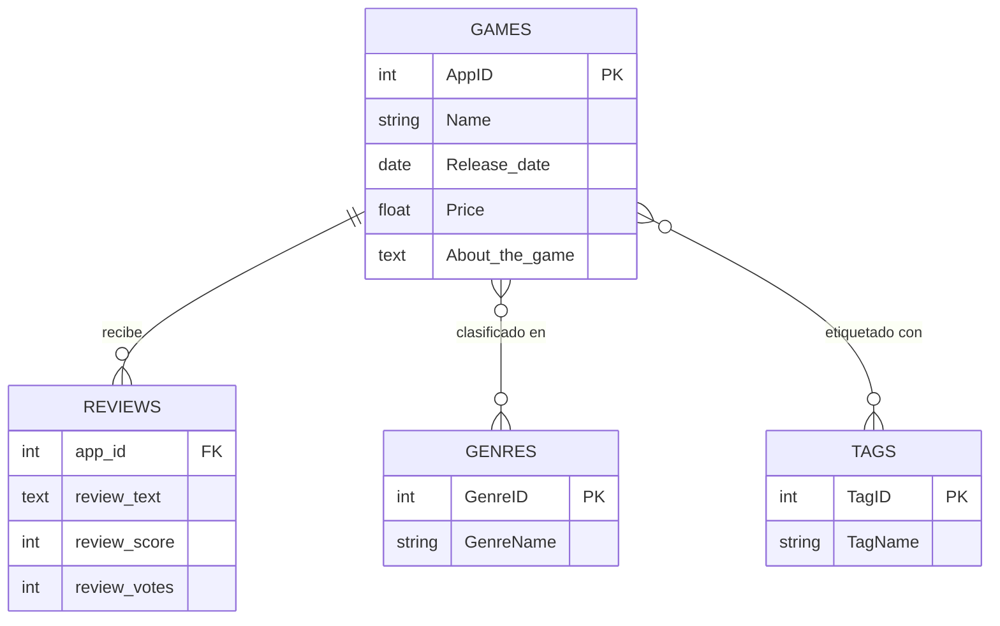

# Hito 1: Propuesta de Proyecto y Dataset V1 - Steam Nexus

## 1. Declaración del Proyecto

**Dominio:** Entretenimiento Digital y Videojuegos (Ecosistema Steam).

**Problema:** El presente proyecto se enmarca en el dominio del entretenimiento digital, específicamente en el ecosistema de videojuegos de la plataforma Steam. Este entorno se caracteriza por su amplio volumen de contenido, superando los 100,000 títulos disponibles, lo que genera un escenario complejo para la toma de decisiones por parte de los usuarios.

En este contexto, se identifica como problemática principal la denominada “parálisis por análisis”, fenómeno que ocurre cuando los usuarios se enfrentan a una sobrecarga de opciones e información, lo que retrasa o incluso bloquea la toma de decisiones. Este comportamiento suele estar asociado a la necesidad de evaluar demasiadas alternativas, el miedo a tomar una decisión incorrecta y la dificultad para comparar múltiples variables simultáneamente, lo que impacta negativamente en la experiencia del usuario (Boogaard, 2024).

Asimismo, los sistemas de recomendación tradicionales, si bien tienen como objetivo ayudar a los usuarios a encontrar contenido relevante de manera personalizada, presentan limitaciones importantes. En particular, se ha evidenciado la existencia de un sesgo de popularidad, donde los algoritmos tienden a recomendar predominantemente los elementos más populares del catálogo, reduciendo la exposición de aquellos pertenecientes a la “cola larga”. Este comportamiento no solo limita la diversidad y el valor de las recomendaciones para los usuarios, sino que también puede generar efectos de retroalimentación que refuerzan la popularidad de ciertos elementos a lo largo del tiempo (Klimashevskaia et al., 2024).

**Pregunta del Producto:** A partir de esta problemática, se plantea la siguiente pregunta de producto: ¿Es posible descubrir segmentos latentes de videojuegos y predecir el éxito de nuevas combinaciones de géneros mediante el uso de técnicas de inteligencia de grafos y procesamiento de lenguaje natural?

**Idoneidad para el curso:** La idoneidad de este proyecto para el curso radica en la naturaleza masiva y compleja del dataset de Steam, el cual permite abordar múltiples etapas del análisis de datos. Entre ellas, se incluyen la ingestión de metadatos y reseñas de usuarios, la ingeniería de características mediante técnicas de procesamiento de lenguaje natural aplicadas a descripciones textuales (y potencialmente análisis de audio en trailers), el agrupamiento de géneros híbridos, y el desarrollo de sistemas de recomendación basados en grafos que modelen relaciones de co-ocurrencia entre etiquetas.

## 2. Inventario de Fuentes

- **Nombre:** Steam Games & Reviews Dataset (2024).
- **Origen:** [Kaggle - Games](https://www.kaggle.com/datasets/fronkongames/steam-games-dataset) y [Kaggle - Reviews](https://www.kaggle.com/datasets/andrewmvd/steam-reviews).
- **Licencia:** MIT y CC BY-NC-SA 4.0.
- **Formato:** CSV.
- **Tamaño Estimado:** ~123,000 juegos y >6.4M reseñas (~2GB+ total).

## 3. Borrador de Esquema

El proyecto se estructura sobre dos entidades principales conectadas de forma relacional:

### Entidades y Claves
1. **Entidad: Games (Maestro de Juegos)**
   - **Clave Primaria (PK):** `AppID`
   - **Atributos clave:** `Name`, `Release date`, `Price`, `Genres`, `Tags`, `About the game`.
   
2. **Entidad: Reviews (Transaccional de Opiniones)**
   - **Clave Primaria (PK):** `ReviewID` (Generado durante la ingesta).
   - **Clave Foránea (FK):** `app_id` (Referencia a `Games.AppID`).
   - **Atributos clave:** `review_text`, `review_score`.

3. **Entidad: Genres (Atributos de Clasificación)**
   - **Clave Primaria (PK):** `GenreID`
   - **Atributos clave:** `GenreName`.

4. **Entidad: Tags (Atributos de Comunidad)**
   - **Clave Primaria (PK):** `TagID`
   - **Atributos clave:** `TagName`.

### Uniones (Joins) Esperadas
Para cumplir con las preguntas del producto, se realizarán las siguientes operaciones de integración:

- **Games [Inner Join] Reviews:** Se unirá la metadata de los juegos con sus reseñas mediante `AppID = app_id`. Esto permitirá filtrar reseñas por géneros específicos y analizar sentimientos por categoría de juego.
- **Normalización de Tags (Self-Join/Explode):** Dado que la columna `Tags` contiene múltiples valores, se realizará una operación de "explode" para convertir cada tag en una fila independiente, permitiendo uniones tipo grafo para el análisis de co-ocurrencia.

## 4. Conjunto de Datos Procesado V1

Se ha completado la primera fase de ingesta y limpieza utilizando el script `src/ingestion_v1.py`. 

**Resultados de la V1:**
- **Ubicación:** `data/processed/dataset_v1.csv`
- **Limpieza realizada:** 
    - Eliminación de registros sin nombre.
    - Normalización de precios a formato numérico.
    - Manejo de valores nulos en descripciones y etiquetas.
- **Total de registros listos:** 122,611 juegos.
